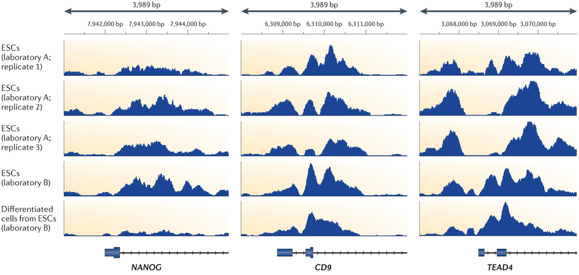
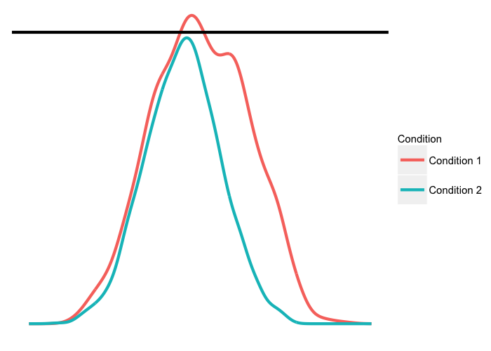
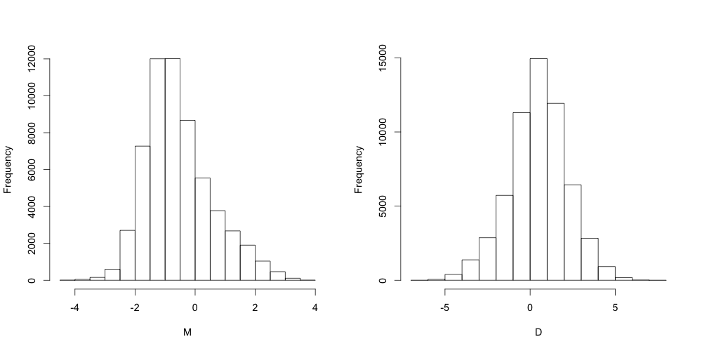

## Introductions

 

Next generation sequencing has been used to identify the locations of regulatory regions. We call them regulome data because they study the whole set of regulatory components in a cell.

 

ChIP-seq: Detect binding sites of transcription factors

 

DNase-seq, ATAC-seq, FAIRE-seq, MNase-seq: Detect chromatin accessibility

---

## Introductions

Source: Clifford A. Meyer and X. Shirley Liu (2014) Identifying and mitigating bias in next-generation sequencing methods for chromatin biology. Nat Rev Genet.

---

## Introductions

 

Two foundamental steps in analyzing regulome data:

 

1. Peak Calling: Identify genomic regions with enriched signals

2. Differential Binding Analysis: Identify genomic loci that show differential epigenomic signals between two cell types/treatments/conditions

---

## Introductions

Source: Clifford A. Meyer and X. Shirley Liu (2014) Identifying and mitigating bias in next-generation sequencing methods for chromatin biology. Nat Rev Genet.

---

## Introductions

 

Two-stage Analysis:

Methods for peak calling: Cisgenome, MACS, QuEST, HPeak, PeakSeq, BayesPeak

Methods for differential analysis: DBChIP, MAnorm, DiffBind, limma, edgeR, DEseq

 

Disadvantage:

Assignment of peak identities is potentially biased

---

## Introductions

---

## Introductions

 

One-stage Analysis: ChIPDiff, ODIN, THOR

 

Disadvantage: 

Peak identity scheme too simple: background; condition 1 enriched; condition 2 enriched

Can only analyze two conditions

---

## Objectives

Jointly identify peak identities

---

## Data

 

K562 and HUVEC cell lines

Histone modification ChIP-seq data for 8 histone marks and DNase-seq data 

 

Preprocessing:

1. All data are log2 transformed after adding pseudocount of 0.5.

2. For each data type and cell type, the 2 replicates are averaged.

3. Input signals are subtracted from ChIP-seq data.

---

## Methods

For each bin, model the minimum signal of the two cell types (M=min(K562,HUVEC)) as well as the difference of signals between the two cell types (D=K562-HUVEC).

Six states Z:

1. Both K562 and HUVEC have no signal (M small; D around 0)

2. K562 has no signal, HUVEC has signal (M small; D negative)

3. K562 has signal, HUVEC has no signal (M small; D positive)

4. Both K562 and HUVEC have signals, no differential (M large; D around 0)

5. Both K562 and HUVEC have signals, K562 significantly lower than HUVEC (M large; D negative)

6. Both K562 and HUVEC have signals, K562 significantly higher than HUVEC (M large; D positive)

---

## Methods

Empirical Distributions of M and D for H3K4me1 data

---

## Methods

Assume M and D are independent, for bin i:

$(M_i,D_i|Z_i=1) \sim N(\mu_1,\sigma_1^2)N(\mu_3,\sigma_3^2)$

$(M_i,D_i|Z_i=2) \sim N(\mu_1,\sigma_1^2)N(\mu_4,\sigma_4^2)$

$(M_i,D_i|Z_i=3) \sim N(\mu_1,\sigma_1^2)N(\mu_5,\sigma_5^2)$

$(M_i,D_i|Z_i=4) \sim N(\mu_2,\sigma_2^2)N(\mu_6,\sigma_6^2)$

$(M_i,D_i|Z_i=5) \sim N(\mu_2,\sigma_2^2)N(\mu_7,\sigma_7^2)$

$(M_i,D_i|Z_i=6) \sim N(\mu_2,\sigma_2^2)N(\mu_8,\sigma_8^2)$

$\mu_1<\mu_2$

$\mu_3<\mu_4<\mu_5$

$\mu_6<\mu_7<\mu_8$

---

## Methods

The full likelihood is:

$p(M,D,Z)=\prod_i [N(M_i,\mu_1,\sigma_1^2)N(D_i,\mu_3,\sigma_3^2)]^{\delta(Z_i=1)}[N(M_i,\mu_1,\sigma_1^2)N(D_i,\mu_4,\sigma_4^2)]^{\delta(Z_i=2)}$

$[N(M_i,\mu_1,\sigma_1^2)N(D_i,\mu_5,\sigma_5^2)]^{\delta(Z_i=3)}[N(M_i,\mu_2,\sigma_2^2)N(D_i,\mu_6,\sigma_6^2)]^{\delta(Z_i=4)}$

$[N(M_i,\mu_2,\sigma_2^2)N(D_i,\mu_7,\sigma_7^2)]^{\delta(Z_i=5)}[N(M_i,\mu_2,\sigma_2^2)N(D_i,\mu_8,\sigma_8^2)]^{\delta(Z_i=6)}$

Use EM-algorithm to estimate $\mu_k$ and $\sigma_k^2$

Assign peak states using the highest posterior probabilities $\tilde{Z}_i=argmax_k P(Z_i=k|\mu,\sigma^2)$

Rank peaks using the posterior probabilities (after normalization)

$P_{i\tilde{Z}_i}=\frac{P(Z_i=\tilde{Z}_i|\mu,\sigma^2)}{\sum_{j} P(Z_i=j|\mu,\sigma^2)}$ 

---

## Results

Data | HH | HL | HM | LH | LL | LM
--- | --- | --- | --- | --- | --- | ---
H3K4me1 | 4601 | 6893 | 9340 | 25199 | 4569 | 8395
H3K4me2 | 4956 | 1249 | 1838 | 13372 | 9977 | 27605
H3K4me3 | 1624 | 906 | 3468 | 24809 | 2314 | 25876
H3K9ac | 1808 | 970 | 2805 | 11957 | 5340 | 36117
H3K9me1 | 17561 | 7674 | 13789 | 3393 | 1820 | 14760
H3K27ac | 3247 | 771 | 1513 | 3645 | 4796 | 45025
H3K27me3 | 8275 | 6463 | 15395 | 25480 | 1665 | 1719
H4K20me1 | 18695 | 7272 | 11277 | 3123 | 1425 | 17205
DNase | 6664 | 2205 | 519 | 35548 | 12485 | 1576

 

HH: Both K562 and HUVEC have signals, K562 significantly higher than HUVEC;
HL: Both K562 and HUVEC have signals, K562 significantly lower than HUVEC;
HM: Both K562 and HUVEC have signals, no differential;
LH: K562 has signal, HUVEC has no signal;
LL: K562 has no signal, HUVEC has signal;
LM: Both K562 and HUVEC have no signal

--- .segue .dark

Thank you!
-----

